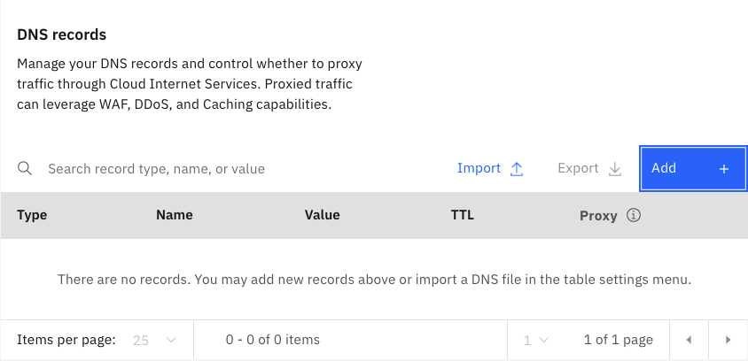
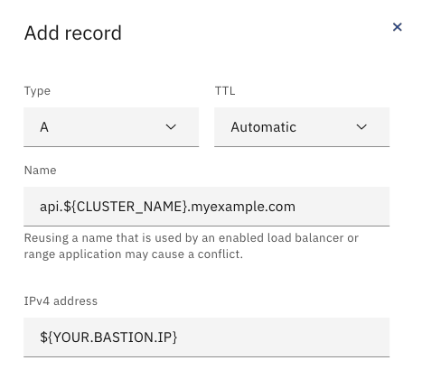

---
hide:
  - footer
---
<script>
  document.title = "Deploy OCP - KVM";
</script>

#KVM Install


At this point, you have a bastion machine where you have installed the Daffy tool, created your core &lt;ENVIRONMENT_NAME&gt;-env.sh, and can execute the install of OCP on **K**ernel-based **V**irtual **M**achine (KVM). A KVM deployment differs from other OCP deployments in that a KVM is both a bare metal server and a bastion machine. This bastion is where you install the Daffy tool.

## Platform Requirements

To use Daffy on KVM, there are some platform info and requirements that need to be gathered or met. We have a simple doc that you should refer to that list all providers and what would be needed. For KVM, it breaks down to the following three basic items:

**Hardware** - enough to run the OCP Cluster based on T-Shirt Sizing

**OS Version** - Ubuntu 20.0.4 (**only supported by Daffy**)

**Permission** - full root authority. For IBM Cloud's KVM bastion, you already have full root authority.

For detailed list of the above, you can find in the Daffy Provider Requirements. Please review before proceeding: [https://ibm.box.com/v/DaffyProviderRequirements](https://ibm.box.com/v/DaffyProviderRequirements){target=_blank}

Public DNS Setup:

You will need to create DNS entries and domain. For the OpenShift install, you need the following:

1. Registered DNS Name - **myexample.com**
2. DNS Entries - **myexample-com**
    1. api.${CLUSTER_NAME}.**myexample.com**        --->    ${YOUR.BASTION.IP}
    2. api-int.${CLUSTER_NAME}.**myexample.com**    --->    ${YOUR.BASTION.IP}
    3. *.apps.${CLUSTER_NAME}.myexample.com         --->    ${YOUR.BASTION.IP}


**Setting up DNS for KVM Deployment with IBM Cloud Internet Services:**

1. Register domain name. Detailed instructions for domain registration can be found on the [IBM Cloud Domain Name Registration page](https://cloud.ibm.com/catalog/infrastructure/domain_registration).
2. Create an IBM Cloud Internet Services (CIS) resource. You can find IBM CIS by searching for "Internet Services" in the IBM Cloud catalog. IBM CIS will prompt you for your domain name during resource creation.
3. Add the 3 DNS entries previously mentioned. Detailed instructions can be found on the [Getting Started on IBM CIS page](https://cloud.ibm.com/docs/cis?topic=cis-getting-started).
    1. Find your IBM CIS service in your resource list and click on it to access the console
    2. On the left menu, click on "Reliability"
    3. On the Reliability page menu, below your domain name and next to Global load balancers, click on "DNS."
    4. At the bottom of the page, you will find a list of DNS records. Click on the "Add button."
    
    5. You can now add the 3 required DNS entries for OCP install
    

## Environment File

Deploying the OpenShift on **K**ernel-based **V**irtual **M**achine only requires two entries to your <b>existing</b> core environment file (<ENVIRONMENT_NAME>-env.sh).

!!! Note
      You can copy the sample file to build your new environment file:
      ``` console
      cp /data/daffy/env/samples/kvm-upi-env.sh /data/daffy/env/<ENVIRONMENT_NAME>-env.sh
      ```

**<u>Valid Options:</u>**

**OCP_INSTALL_TYPE=** kvm-upi

**BASTION_HOST**="xxx.xxx.xxx.xxx"

If your host does not have its own public IP address, you need to specify the bastion IP address that the OCP cluster would use to reach your bastion host, i.e. its local IP address you used to connect to the bastion.

If you plan to install a cloud pak and/or need storage, you need to set the flag to setup OCS Storage:

``` console
OCP_CREATE_OPENSHIFT_CONTAINER_STORAGE=true
```

## Execution

To deploy your OCP cluster to Kernel-based Virtual Machine, run the build.sh script from the /data/daffy/ocp directory:

```console
/data/daffy/ocp/build.sh <ENVIRONMENT_NAME>
```

!!! Note
    &lt;ENVIRONMENT_NAME&gt; is the first part of your name that you used for the &lt;ENVIRONMENT_NAME&gt;-env.sh file

Once your cluster is fully deployed you can access the help menu which has a number of options:

```console
/data/daffy/ocp/build.sh <ENVIRONMENT_NAME> --help
```

<button onclick="location.href='../../Cloud-Paks/'" class="custom-btn btn-7">
Installing Cloud Paks</button>
